# Tools and Supplies

> **Disclaimer:** I may earn a commission from purchases made through this page. This helps support the content and recommendations I provide.

## Hardware

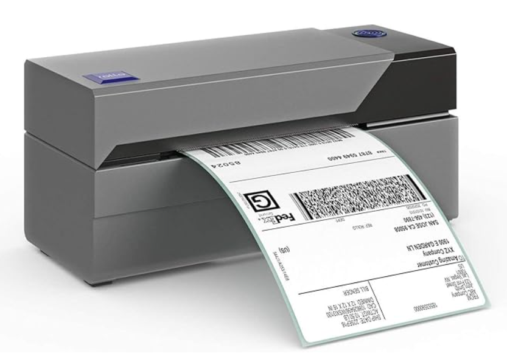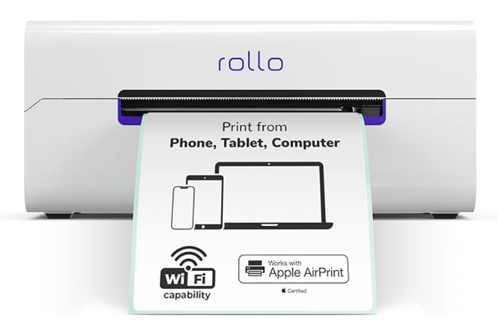

**Rollo Thermal Printers**

Stop cutting out mailing labels and taping them to packages. This thermal printer prints 4x6 labels fast that you can just peel and stick.

[View on Amazon](https://amzn.to/4kWCORr) (older model)

[View on Amazon](https://amzn.to/4shMLLP) (newer model w/ network connection)

**Guillotine Paper Cutter**

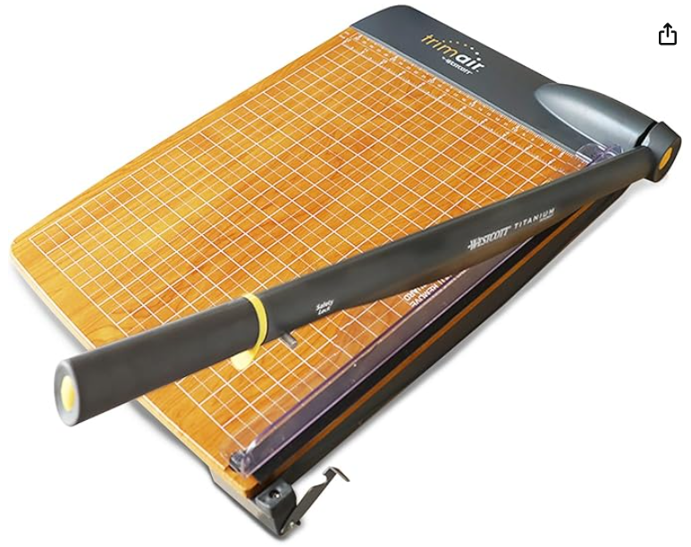

It's a lot cheaper to print your own fliers and inserts 2 or 4 to a page and then cut them with a good paper cutter. I use this to prep 100 fliers at a time. It also works for cutting cardboard inserts.

[View on Amazon](https://amzn.to/4r0uZLQ)

**Card-Friendly Document Scanners**

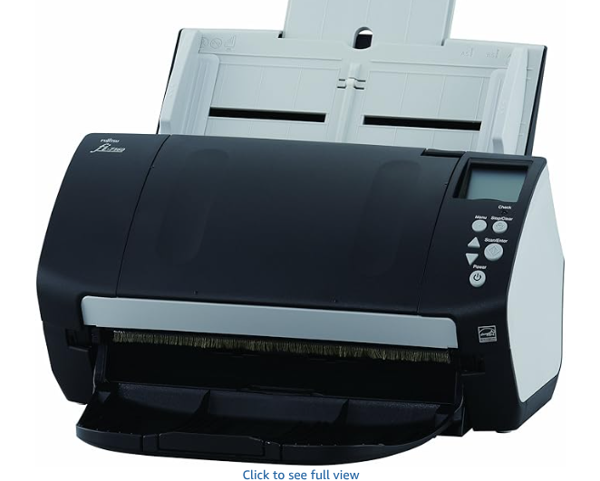
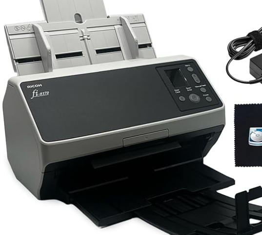

Scanning cards rapidly is a big part of my bulk listing workflow. I personally use the older 7160 model, but the 8170 has some nice options that make it appealing.

[View on Amazon](https://amzn.to/4tULyLJ) (fi-7160)

[View on Amazon](https://amzn.to/46svVRX) (fi-8170)

## Supplies

**Thermal Shipping Labels**

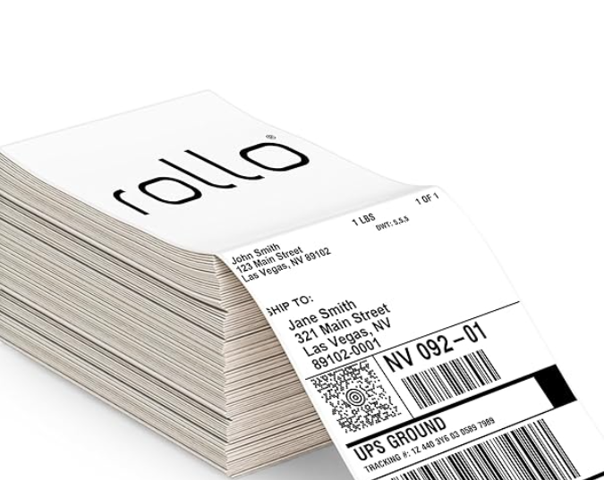

I always have the stack in use and an extra box so I never run out.

[View on Amazon](https://amzn.to/4b9m06m) (older model)

**Rigid Envelopes and Bubble Mailers**

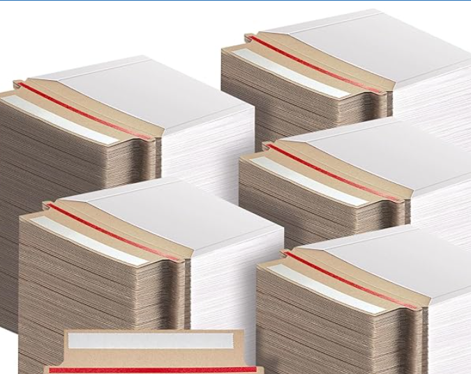
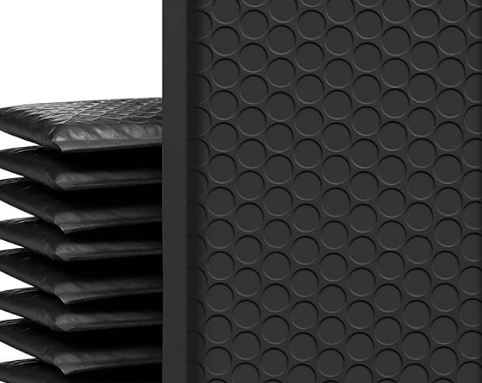

I keep a lot of each on hand.

[View on Amazon](https://amzn.to/4ryLTSN) (rigid mailers)

[View on Amazon](https://amzn.to/4kWDkyR) (4x8 bubble)

[View on Amazon](https://amzn.to/4kTQMnb) (6x10 bubble)

**Graded Card Bags**

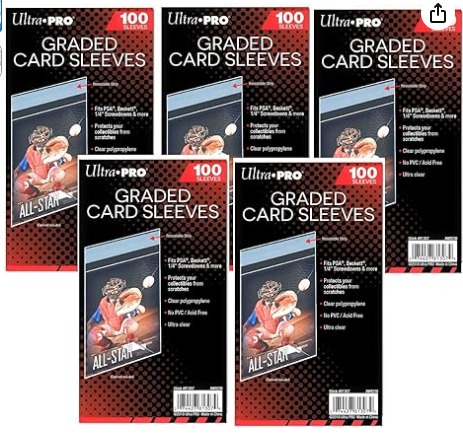

You can use blue painter's tape to keep cards from slipping out of toploaders, but I find these to work great and use at least 1 per order.

[View on Amazon](https://amzn.to/4rK9vnS)

## Platforms

**Card Dealer Pro (CDP)**

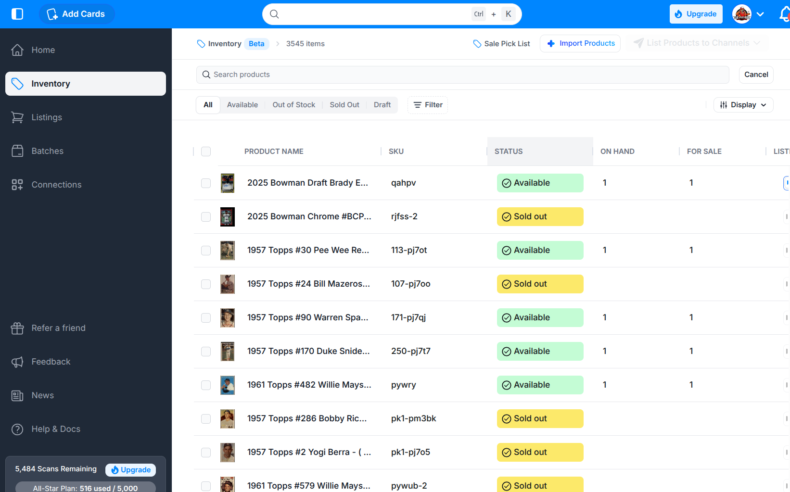

I use CDP as my home base for bulk selling. From here, can upload 200+ or more images and let its AI automations do much of the work, saving me from having to type in each card title and details. Their pricing tools are not perfect, but they're pretty good and also save me time. Once a batch is ready, I can list to eBay or CollX with one click (also WhatNot or Shopify if I used either) and I can export a CSV to list anywhere else I can batch import (like District). Plans start at $9/month (500 AI scans) and go up depending on how many scans you need.

[Start Selling on District](https://v2-carddealerpro.cello.so/9EOhqCCWu7y)

**District**

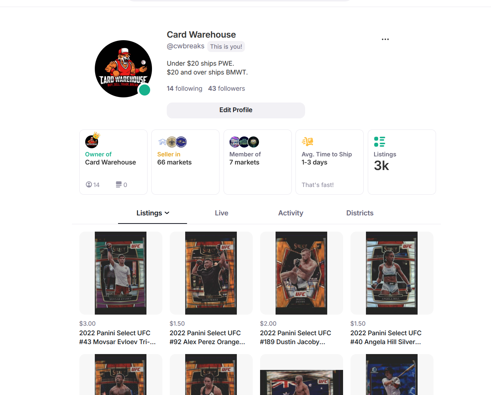

District is a fast-growing platform built by and for collectors with the ability to list BIN, auctions, or host live stream selling events. Their import works well for listing large batches quickly and scripts in this repository help streamline that process.

[Start Selling on District](https://district.net/card-warehouse?referral=CWBREA64)

**eBay**

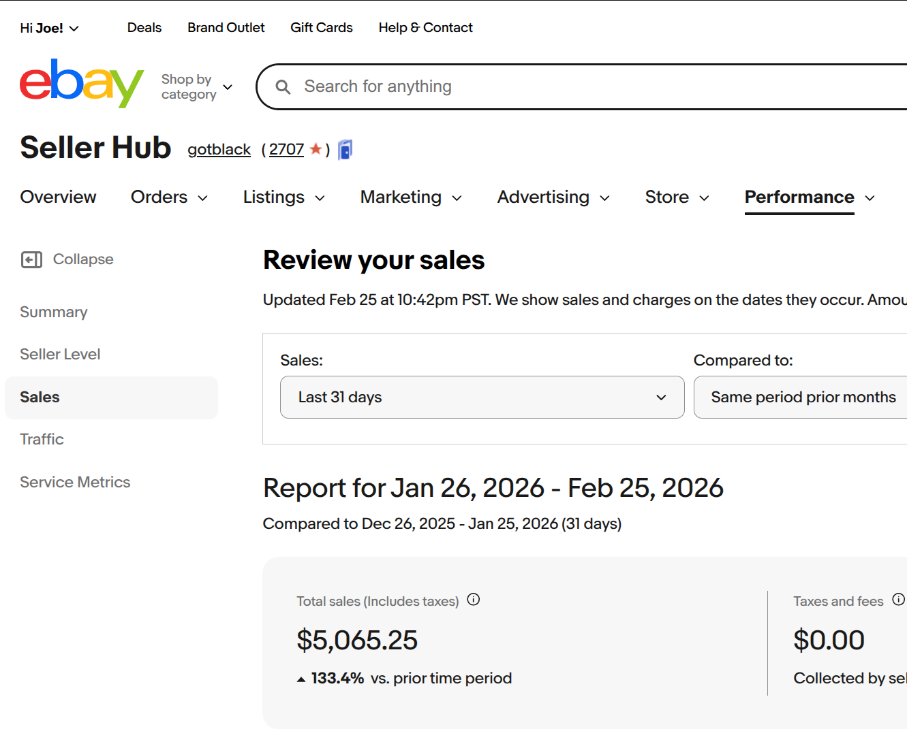

eBay really doesn't need an introduction. It's been around for decades and drives the most passive sales of the platforms I use.

[Start Selling on eBay](https://ebay.com/sell)

**CollX**

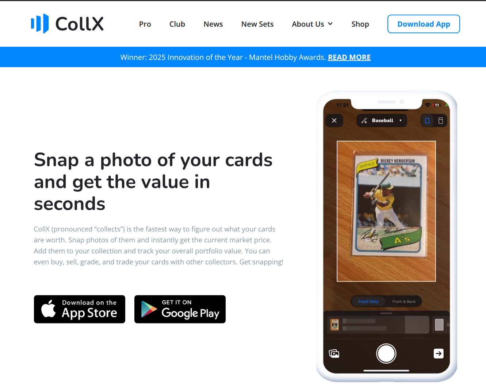

I'm a desktop guy, so CollX is harder for me to adjust to and I have to email each shipping label to myself so I can print it from my desktop since my Rollo is not networked. That said, it's integrated with CDP (listed above), so sending a batch to it is a one-click process. They also have integrated labels, so I don't worry about how much shipping costs as their platform just handles all that.

[Sign up for CollX](https://collx.app/)
